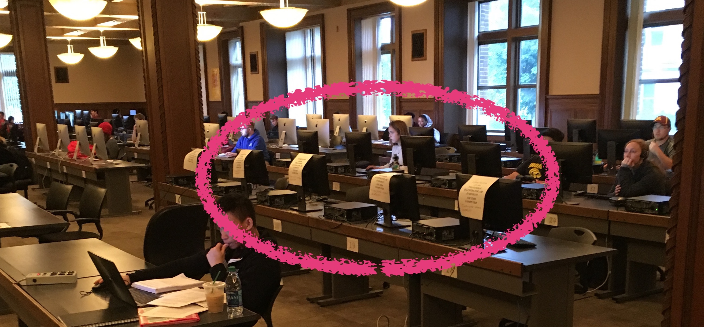

```{r knitr_init, echo=FALSE, cache=FALSE}
library(knitr)
library(rmdformats)
library(fontawesome)

## Global options
options(max.print="75")
opts_chunk$set(echo=FALSE,
	             cache=TRUE,
               prompt=FALSE,
               tidy=TRUE,
               comment=NA,
               message=FALSE,
               warning=FALSE)
opts_knit$set(width=75)
```


# Welcome


Welcome to *EPsy 3264: Basic and Applied Statistics*.   

<!-- - **Syllabus, assignments, data, and script files:** [github repository](https://github.com/zief0002/epsy-8251) -->
<!-- - **Course notes and readings:** [website](https://zief0002.github.io/book-8252/) | [github repository](https://github.com/zief0002/book-8252) -->


<br />

### Instructor {-}

**Andrew Zieffler** ([zief0002@umn.edu](mailto://zief0002@umn.edu)) <br />
*Office:* [Education Sciences Building 178](https://www.google.com/maps/place/Education+Sciences+Building/@44.9784043,-93.2394586,15z/data=!4m2!3m1!1s0x0:0x45656dac481b9150)  <br />
*Office Hours:* Tuesday 9:00 AM&ndash;10:00 AM; and by appointment

<br />

### Classroom

- Monday/Wednesday (9:45&ndash;11:00): [Bruininks Hall 131A](https://campusmaps.umn.edu/robert-h-bruininks-hall)

<br />


### Course Content and Syllabus {-}

EPsy 3264 is designed to engage students using a modeling and simulation approach to inference. This course uses pedagogical principles that are founded in research, such as daily small group activities and discussion. Upon completion of this course, students should have an understanding of the foundational concepts of data, variation and inference, as well as an appreciation for the fundamental role that statistics plays in a host of disciplines, such as business, economics, law, and medicine.

- The course syllabus is available  [here](https://github.com/zief0002/epsy-3264/raw/master/2019-fall-epsy-3264-zieffler.pdf).

<br />

### Course Materials {-}

- The course textbook, which includes the out-of-class readings, is available online at http://zief0002.github.io/statistical-thinking/.

- You will work from the lab manual, *Statistical Thinking 4.2: A Simulation Approach to Modeling Uncertainty*, every day in class. [Click here to download a PDF copy of the lab manual.](https://github.com/zief0002/statistical-thinking/blob/master/statistical-thinking-v4_2.pdf?raw=true) You will need to bring the lab manual to class with you every day.

- There are several data sets used in the lab manual, as well as in EPSY 3264
assignments. [Click here to download a ZIP file to your computer that includes all the data sets.](https://github.com/zief0002/statistical-thinking/blob/master/data.zip?raw=true) Once the ZIP file has been downloaded to your computer, double-click the ZIP file to unzip it and access the materials.

- Much of the material presented in the lab manual requires the use of TinkerPlots&trade;. This software can be downloaded (for Mac or PC), and a license can be purchased from http://www.tinkerplots.com/. Note, since this software needs to be installed, it will not work on a Chromebook or other notebooks that only run web apps.

<br />

### TinkerPlots on Campus{-}

TinkerPlots is installed on four computers in the [Walter Library](https://campusmaps.umn.edu/walter-library) computer lab (WALIB 105; Computers 18&ndash;21). These computers are marked with a sign indicating that TinkerPlots is installed on them. 

```{r echo=FALSE, fig.align='center'}

```


<br />

### Getting Help{-}

There are several things you can do to be successful in this course. First and foremost, complete all of the readings and come prepared to class. Complete all of the lab assignments. Ask questions. If you are experiencing problems, need help, or have any questions or other course-related concerns, do not hesitate to get in touch with the instructor or one of the Teaching Assisstants. Note: If you are unable to meet during the scheduled office hours, we can work with you to find a day/time that works in your schedule!

<br />

We have four Teaching Assisstants who you can help you with the course material:

<br />

**Jesslyn Valerie** ([valer066@umn.edu](mailto://valer066@umn.edu))  <br />
*Office:* [Education Sciences Building 196](https://www.google.com/maps/place/Education+Sciences+Building/@44.9784043,-93.2394586,15z/data=!4m2!3m1!1s0x0:0x45656dac481b9150)  <br />
*Office Hours:* Wednesday 1:00 PM&ndash;2:00 PM; and by appointment

<br />

**Sam Ihlenfeldt** ([ihlen010@umn.edu](mailto://ihlen010@umn.edu))  <br />
*Office:* [Education Sciences Building 193](https://www.google.com/maps/place/Education+Sciences+Building/@44.9784043,-93.2394586,15z/data=!4m2!3m1!1s0x0:0x45656dac481b9150)  <br />
*Office Hours:* Wednesday 11:30 AM PM&ndash;12:30 PM; and by appointment

<br />

**Johanna Schultz** ([schu4338@umn.edu](mailto://schu4338@umn.edu))  <br />
*Office:* [Education Sciences Building 192](https://www.google.com/maps/place/Education+Sciences+Building/@44.9784043,-93.2394586,15z/data=!4m2!3m1!1s0x0:0x45656dac481b9150)  <br />
*Office Hours:* Monday 10:00 AM&ndash;11:00 AM; and by appointment

<br />

**Manos Hatzimalonas** ([chatz006@umn.edu](mailto://chatz006@umn.edu))  <br />
*Office:* [Education Sciences Building 192](https://www.google.com/maps/place/Education+Sciences+Building/@44.9784043,-93.2394586,15z/data=!4m2!3m1!1s0x0:0x45656dac481b9150)  <br />
*Office Hours:* Thursday 1:30 PM&ndash;3:30 PM; and by appointment

<br />

Before coming for help, you may want to review the [Asking Helpful Questions](https://zief0002.github.io/epsy-3264/#questions) section of the website.

```{r child = 'schedule.Rmd'}
```


```{r child = 'assignments.Rmd'}
```


```{r child = 'questions.Rmd'}
```


