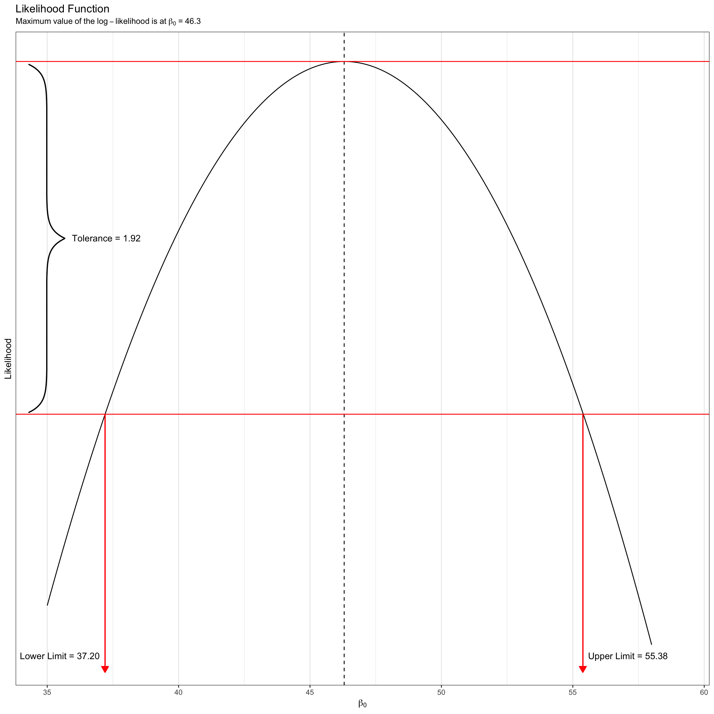

```{r echo=FALSE}
options(scipen = 99)
```


## Probability Density

The probability density for an observed value *x* drawn from a normal distribution is defined as

$$
p(x) = \frac{1}{\sigma\sqrt{2\pi}}\exp\left[-\frac{(x-\mu)^2}{2\sigma^2}\right]
$$

for $-\infty \leq x \leq \infty$. 

Consider a normal distribution with a mean of 50, and a standard deviation of 10. We can compute the probability density, $p(x)$, for a particular $x$ value by using this equation. For example, the probability density for $x=65$ can be found using,

$$
p(65) = \frac{1}{10\sqrt{2\pi}}\exp\left[-\frac{(65-50)^2}{2\times10^2}\right] = 0.01295176
$$

Using R, we can carry out the computation,

```{r}
(1/(10*sqrt(2*pi))) * exp(-(225)/200)
```

There is also a more direct way to compute this using the `dnorm()` function. This function computes the density of `x` from a normal distribution with a specified `mean` and `sd`.

```{r}
dnorm(x = 65, mean = 50, sd = 10)
```

If we compute the density for several $x$ values and plot them, we get the familiar normal shape; the graphical instantiation of the mathematical equation.


```{r out.width='3.5in', message=FALSE}
library(tidyverse)

data.frame(
  X = seq(from = 10, to = 90, by = 0.01)
) %>% 
  rowwise() %>%
  mutate( Y = dnorm(x = X, mean = 50, sd = 10) ) %>%
  ggplot(data = ., aes(x = X, y = Y)) +
    geom_line() +
    theme_bw() +
    geom_point(x = 65, y = 0.01295176, size = 3)
```

*Figure 1.* Plot of the probability density function (PDF) for a Normal distribution with mean of 50 and standard deviation of 10. The density value for $x=65$, $p(65)= 0.01295176$, is also displayed on the PDF.


## Joint Probability Density

Joint probability density is simply the density of $x_1$, $x_2$, \ldots AND $x_k$. If we can make an assumption about INDEPENDENCE, then the joint density would be the product of the individual densities,

$$
p(x_1, x_2, x_3, \ldots, x_K) = p(x_1) \times p(x_2) \times p(x_3) \times \ldots \times p(x_k)
$$

Say we had three indpendent observations from our $\sim\mathcal{N}(50,10)$ distribution, namely $x =\{60, 65, 67\}$. Then the joint density would be,

```{r}
dnorm(x = 60, mean = 50, sd = 10) * dnorm(x = 65, mean = 50, sd = 10) * dnorm(x = 67, mean = 50, sd = 10)
```

We could also shortcut this computation,

```{r}
prod(dnorm(x = c(60, 65, 67), mean = 50, sd = 10))
```

This value is the joint probability density of observing the data (60, 65, AND 67) if these observations were drawn from a normal distribution with mean of 50 and standard deviation of 10. 

\newpage

## Likelihood

In the previous example, the joint probability density indicates the probability of the data GIVEN the distribution and parameters. Likelihood is the probability of a particualar set of parameters GIVEN the data and distribution.

$$
\begin{split}
\mathrm{Joint~Probability~Density} &= p\biggl(\mathrm{Data} \mid \mathrm{Parameters~and~Distribution}\biggr) \\
\mathrm{Likelihood} (\mathcal{L}) &= p\biggl(\mathrm{Parameters} \mid \mathrm{Data~and~Distribution}\biggr)
\end{split}
$$

We might ask the question, given the observed data $x = \{30, 20, 24, 27\}$ come from a normal distribution, what is the likelihood (probability) that the mean is 20 and the standard deviation is 4? We are asking for

$$
p\biggl(\mu=20,\sigma=4,~|~x=\{30,20,27\}~\mathrm{and}~\mathcal{N} \biggr)
$$

To answer this we compute the joint density under that particular set of parameters.

```{r}
prod(dnorm(x = c(30, 20, 24, 27), mean = 20, sd = 4))
```

The likelihood that $\mu=20$ and $\sigma=4$ given the observed data is 0.00000057. What is the likelihood (probability) that the mean is 25 and the standard deviation is 4?

```{r}
prod(dnorm(x = c(30, 20, 24, 27), mean = 25, sd = 4))
```

The likelihood that $\mu=25$ and $\sigma=4$ given the observed data is 0.0000177. Which set of parameters is more likely given the data and that they come from a normal distribution? The second set of parameters is more likely since it has a higher likelihood.


## Maximum Likelihood

So now we come to the crux of Maximum Likelihood. It is to choose a set of parameters that MAXIMIZES the likelihood given the data and a distribution. In our example, given the observed data $x = \{30, 20, 24, 27\}$ come from a normal distribution, what are the values for the paramters (mean and standard deviation) that give the highest liklihood?

One way to determine this is to use a grid search. A grid search is the fancy computational way of saying try a whole bunch of options for the parameters (called the search space). For each set of parameters in our search space, we will compute the likelihood, and then choose the set of parameter values that give the highest likelihood. Computationally, here is one way to perform a grid search:

```{r}
expand.grid(
  mu = seq(from = 10, to = 30, by = 0.1),
  sigma = seq(from = 0, to = 10, by = 0.1)
  ) %>%
  rowwise() %>%
  mutate( lik = prod(dnorm(c(30, 20, 24, 27), mean = mu, sd = sigma)) ) %>%
  arrange(desc(lik))
```

The parameters that maximize the likelihood (in our search space) are a mean of 25.2 and a standard deviation of 3.7.


## Maximum Likelihood Estimation for Regression

In model fitting, the components we care about are the residuals. Those are the things we put distributional assumptions on (e.g., normality, homogeneity of variance, independent). So we want to determine the parameter values ($\beta_0$, $\beta_1$) that maximize the likelihood for a given set of residuals that come from a normal distribution. 

To understand this, let's examine some toy data composed of the following ten $X$ and $Y$ values.

```{r}
# Enter data into vectors
x = c(4, 0, 3, 4, 7, 0, 0, 3, 0, 2)
y = c(53, 56, 37, 55, 50, 36, 22, 75, 37, 42)
```

We will write a function to compute the likelihood (or log-likelihood) of the residuals given a particular `b0` and `b1` estimate that will be inputted to the function. One issue is that in using the `dnorm()` function we need to specify the mean and standard deviation. The regression assumptions help with this.

The conditional mean residual value is 0. So we will set the mean value to 0. The asumption about the standard deviation is that the conditional distributions all have the same SD, but it doesn't speicfy what that is. However, the SD of the errors seems like a reasonable value, so let's use that.  

Here we write a function to compute the likelihood.

```{r}
likelihood = function(b0, b1){
  errors = y - b0 - b1*x
  sigma = sd(errors)
  lik = prod(dnorm(errors, mean = 0, sd = sigma))
  return(lik)
}
```

Now we can use our function just like any other function. For example, to find the likelihood for the parameter set $\beta_0 = 20$ and $\beta_1 = 5$, we use

```{r}
likelihood(b0 = 20, b1 = 5)
```


\newpage

We can also use our function in a grid search.


```{r}
expand.grid(
  B0 = seq(from = 30, to = 50, by = 0.1),
  B1 = seq(from = -5, to = 5, by = 0.1)
) %>%
  rowwise() %>%
  mutate( lik = likelihood(b0 = B0, b1 = B1) ) %>%
  arrange(desc(lik))
```

Here the parameter values that maximize the likelihood are $b0 = 40.1$ and $b1=2.7$. We can also compute what the standard deviation value was using the estimated parameter values.

```{r}
errors = y - 40.1 - 2.7*x
sd(errors)
```

This value is an *estimate of the RMSE*. In practice, there are a couple subtle differences, namely that the estimate for the SD value we use in `dnorm()` is slightly different. This generally does not have an effect on the coefficient estimates, but does impact the estimate of the RMSE. We will talk more about this when we talk about *Restricted Maximum Likelihood Estimation* (REML).

## Numerical Computation of the Maximum Likelihood Values

In practice, maximum likelihood estimates are found for conventional regression using numerical methods (e.g., calculus) rather than grid search. To see how this is done, we need to dig into the mathematics. Using mathematical notation, we can specify the liklihood as,

$$
\mathcal{L}(\beta_0, \beta_1) = p(\epsilon_1) \times p(\epsilon_2) \times \ldots \times p(\epsilon_n)
$$
where

$$
p(\epsilon_i) = \frac{1}{\sigma\sqrt{2\pi}}\exp\left[-\frac{(\epsilon_i-\mu)^2}{2\sigma^2}\right]
$$

\newpage

The regression assumptions specify that each conditional error distribution is normal distributed with a mean of 0 and some variance (that is the same for all conditional error distributions), we can call it $\sigma^2$. Substituting these things in to the density function, we get,

$$
\begin{split}
p(\epsilon_i) &= \frac{1}{\sigma\sqrt{2\pi}}\exp\left[-\frac{(\epsilon_i-0)^2}{2\sigma^2}\right] \\
&= \frac{1}{\sigma\sqrt{2\pi}}\exp\left[-\frac{(\epsilon_i)^2}{2\sigma^2}\right]
\end{split}
$$


Now we use this expression for each of the $p(\epsilon_i)$ values in the liklihood computation.

$$
\begin{split}
\mathcal{L}(\beta_0, \beta_1) &= p(\epsilon_1) \times p(\epsilon_2) \times \ldots \times p(\epsilon_n) \\
&= \frac{1}{\sigma\sqrt{2\pi}}\exp\left[-\frac{\epsilon_1
^2}{2\sigma^2}\right] \times \frac{1}{\sigma\sqrt{2\pi}}\exp\left[-\frac{\epsilon_2^2}{2\sigma^2}\right] \times \ldots \times \frac{1}{\sigma\sqrt{2\pi}}\exp\left[-\frac{\epsilon_n^2}{2\sigma^2}\right] 
\end{split}
$$
We can simplify this

$$
\begin{split}
\mathcal{L}(\beta_0, \beta_1) &=\left[ \frac{1}{\sigma\sqrt{2\pi}} \right]^n \times \exp\left[-\frac{\epsilon_1^2}{2\sigma^2}\right] \times \exp\left[-\frac{\epsilon_2^2}{2\sigma^2}\right] \times \ldots \times \exp\left[-\frac{\epsilon_n^2}{2\sigma^2}\right] 
\end{split}
$$

### Log-Likelihood

Ultimately we want to compute the derivative of the likelihood. Analytically, working with the natural logarithm of the likelihood makes computing the derivative easiser in two ways. First, when we take the derivative, we are operating on a sum rather than a product. Secondly, the likelihood values are quite small since we are multiplying several probabilities together. Using the log-likelihood makes the metric more tractable by not having such small values, making them less prone to rounding error. 

In general, the likelihood is,

$$
\ln \Bigl(\mathcal{L}\Bigr) = \ln \Biggl(p(x_1) \times p(x_2) \times \ldots \times p(x_n)\Biggr)
$$

On the right-hand side of the equation, the log of a product can be expressed as the sum of the log of each of the product's factors.


$$
\ln \Bigl(\mathcal{L}\Bigr) = \ln \Bigl(p(x_1)\Bigr) + \ln \Bigl(p(x_2)\Bigr) + \ldots + \ln \Bigl(p(x_n)\Bigr)
$$

The log-likelihood is the sum of the log-transformed densities. 

\newpage

### Back to our Regression Estimation

Now we will take the natural logarithm of both sides of the expression of the likelihood

$$
\begin{split}
\ln \Bigl(\mathcal{L}(\beta_0, \beta_1)\Bigr) &= \ln \Biggl( \left[ \frac{1}{\sigma\sqrt{2\pi}} \right]^n \times \exp\left[-\frac{\epsilon_1^2}{2\sigma^2}\right] \times \exp\left[-\frac{\epsilon_2^2}{2\sigma^2}\right] \times \ldots \times \exp\left[-\frac{\epsilon_n^2}{2\sigma^2}\right] \Biggr) \\
\end{split}
$$
We will use a lower-case $\mathcal{l}$ to represent the log-likelihood. Using our rules for logarithms and re-arranging gives,

$$
\mathcal{l}(\beta_0, \beta_1) = -\frac{n}{2} \times \ln (2\pi\sigma^2) - \frac{1}{2\sigma^2} \times \sum \epsilon_i^2
$$

The log-liklihood is a function of $n$, $\sigma^2$ and the Sum of Squared Errors (SSE). The data define $n$ (the sample size) and the other two come from the error terms which are a function of the parameters and the data.

Once we have this function, calculus can be used to find the analytic maximum. To do this, we compute the derivative of the log-likelihood function (called the *score function*), set it equal to zero, and solve for the respective parameters.


## Deviance

The likelihood and log-likelihhod are metrics of the probability of a set of parameter values given the data. Higher values are indicative of a higher probability that these parameters produced the data. Recall that the log-likelihood is computed as,

$$
\mathcal{l}(\beta_0, \beta_1) = -\frac{n}{2} \times \ln (2\pi\sigma^2) - \frac{1}{2\sigma^2} \times \sum \epsilon_i^2
$$

Many times, this value is multiplied by $-2$ to eliminate the negative signs and the two in the denominators. When we multiply the log-likelihood by $-2$, the result is called the deviance.


$$
\begin{split}
\mathcal{D} &= -2 \times \mathcal{l} \\
&= -2 \biggl(-\frac{n}{2} \times \ln (2\pi\sigma^2) - \frac{1}{2\sigma^2} \times \sum \epsilon_i^2\biggr) \\
&= n \times \ln (2\pi\sigma^2) + \frac{1}{\sigma^2} \times \sum \epsilon_i^2
\end{split}
$$


## Using R to Directly Compute the Log-Likelihood, Likelihood, and Deviance

In practice all of the computation is done behind the scenes, and the regression estimates are computed and given to you. If you want to obtain the log-likelihood of a fitted model, we use the `logLik()` function.

```{r}
# Fit the model using lm()
lm.1 = lm(y ~ 1 + x)

# Compute the log-likelihood
logLik(lm.1)
```

The maximum log-liklihood value is $-39.45442$. The $df=3$ indicates that we were actually estimating three parameters: $\beta_0$, $\beta_1$, and $\sigma^2_{}\epsilon$. To compute the likelihood,we need to exponentiate (back-transform) the log-likelihood.

$$
\mathcal{L} = e^{\ln(\mathcal{L})}
$$

To do this in R we can use the `exp()` function.

```{r}
exp(-39.45442)
```

To compute the deviance, we can multiply the log-likelihood value by $-2$. (Note that R has a `deviance()` function that computes the SSE, not the deviance .)

```{r}
# Compute the deviance
-39.45442 * -2

# Computes SSE, not the deviance
deviance(lm.1)
```

Since the deviance has multiplied the log-likehood by a negative value, it will invert the log-likelihood function. So, maximimizing the log-likelihood is equivalent to minimizing the deviance. Conceptually, deviance is associated with error and we want to minimize the error. In the plot below, I show the likelihood function (top), the log-likelihood function (bottom-left) and the deviance function (bottom-right) for optimizing over an intercept-only model. In the first two plots the goal would be to find the value of $\beta_0$ that maximizes the likelihood or log-likelihood, respectively. In the case of the third plot, the goal would be to find the value of $\beta_0$ that minimizes the deviance. Note that all three metrics give the same estimate of $\beta_0$.

```{r echo=FALSE, message=FALSE, fig.width=10, fig.height=10, out.width='4in', fig.align='center'}
likelihood = function(b0){
  errors = y - b0
  sigma = sd(errors)
  lik = prod(dnorm(errors, mean = 0, sd = sigma))
  return(lik)
}

x = expand.grid(
  b0 = seq(from = 35, to = 58, by = 0.1)
) %>%
  rowwise() %>%
  mutate( lik = likelihood(b0 = b0) ) %>%
  mutate(loglik = log(lik), deviance = -2*loglik)

p1 = ggplot(data = x, aes(x = b0, y = lik)) +
  geom_line() +
  labs(
    x = expression(beta[0]), 
    y = "Likelihood", 
    title = "Likelihood Function", 
    subtitle = expression(Maximum~value~of~the~likelihood~is~at~beta[0]~`=`~46.3)
    ) +
  theme_bw() +
  geom_vline(xintercept = 46.3, linetype = "dashed")

p2 = ggplot(data = x, aes(x = b0, y = loglik)) +
  geom_line() +
  labs(
    x = expression(beta[0]), 
    y = "Log-Likelihood", 
    title = "Log-Likelihood Function", 
    subtitle = expression(Maximum~value~of~the~log-likelihood~is~at~beta[0]~`=`~46.3)
    ) +
  theme_bw() +
  geom_vline(xintercept = 46.3, linetype = "dashed")

p3 = ggplot(data = x, aes(x = b0, y = deviance)) +
  geom_line() +
  labs(
    x = expression(beta[0]), 
    y = "Deviance", 
    title = "Deviance Function", 
    subtitle = expression(Minimum~value~of~the~deviance~is~at~beta[0]~`=`~46.3)
    ) +
  theme_bw() +
  geom_vline(xintercept = 46.3, linetype = "dashed")

library(ggpubr)
ggarrange(p1, ggarrange(p2, p3, ncol = 2), nrow = 2)
```

# Producing Confidence Intervals from the Likelihood Function

So far we have used the likelihood function to estimate the parameter values associated with the fixed-effects. We can also use it to give an interval estimate for these coefficients. An interval estimate accounts for the uncertainty associated with estimating the parameter.

In OLS estimation, we would estimate the parameter (say $\beta_0$), then estimate the SE, and finally compute 

$$
\hat\beta_0 \pm 2(SE_{\hat\beta_0})
$$

In likelihood estimation, we find all values of the parameter for which the
log-likelihood is within a given tolerance of the maximum value. In our intercept-only model the maximum value of the log-likeihood, produced when $\beta_0=46.3$, was $-40.55574$. If we set a tolerance of 1.92 (which corresponds to a 95\% CI) our interval estimate would include all $beta_0$-values that have a log-likelihood greater than or equal to $-42.47574$.

Graphically, this looks like the following.

```{r echo=FALSE, message=FALSE, fig.width=6, fig.height=6, out.width='4in', fig.align='center', eval=FALSE}
my_data = data.frame(x = c(35, 59, 59, 35), y = c(-40.55574, -40.55574, -42.47574, -42.47574))

library(grid)
library(pBrackets)

theplot = ggplot(data = x, aes(x = b0, y = loglik)) +
  #geom_polygon(data = my_data, aes(x = x, y = y), fill = "red", alpha = 0.3) +
  geom_line() +
  labs(
    x = expression(beta[0]), 
    y = "Likelihood", 
    title = "Likelihood Function", 
    subtitle = expression(Maximum~value~of~the~log-likelihood~is~at~beta[0]~`=`~46.3)
    ) +
  theme_bw() +
  geom_vline(xintercept = 46.3, linetype = "dashed") +
  scale_y_continuous(breaks = NULL) +
  geom_hline(yintercept = c(-40.55574, -42.47574), color = "red", linetype = c("solid", "solid")) +
  coord_cartesian(xlim=c(35, 59)) +
  annotate(geom = "text", x = 37.25, y =  -41.51574, label = "Tolerance = 1.92") +
  geom_segment(x = 37.2, xend = 37.2, y = -42.47574, yend = -43.88, 
               arrow = arrow(length = unit(0.01, "npc"), type = "closed"), color = "red") +
  geom_segment(x = 55.38, xend = 55.38, y = -42.47574, yend = -43.88, 
               arrow = arrow(length = unit(0.01, "npc"), type = "closed"), color = "red") +
  annotate(geom = "text", x = 55.58, y =  -43.79, label = "Upper Limit = 55.38", hjust = 0) +
  annotate(geom = "text", x = 37.00, y =  -43.79, label = "Lower Limit = 37.20", hjust = 1)

grid.brackets(35, 78, 35, 499, lwd=2, col="black")

```

```{r echo=FALSE, message=FALSE, fig.width=6, fig.height=6, out.width='5in', fig.align='center'}

```

This method of producing an interval estimate is referred to as profiling the likelihood function (sometimes just called profile likelihood).

The likelihood-based interval for $\beta_0$ would be between 37.20 and 55.38. There are two things to consider here. First, if the likelihood function is not symmetric, the interval will also be asymmetric around the $\beta_0$ estimate. Secondly, the curvature of the likelihood function inicates how narrow or wide the interval will be; thus the curvature is related to the uncertainty. In fact, the standard error is a function of the second derivative (or information) of the liklihood function, which is also mathematically related to curvature (see [here](http://citadel.sjfc.edu/faculty/kgreen/vector/block2/der_rev/node9.html)). 
